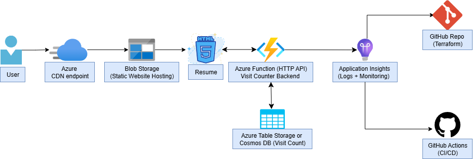

# ☁️ Cloud Resume 

Deployed a resume website on Azure using Terraform. Addtionally used monitoring and policy enforcement.

---

## 📌 Overview

- Static site hosted via Azure Blob
- Infrastructure managed and provisioned using Terraform
- Mapped DNS Zone for custom domain
- Enabled Azure Monitor and configured alerting with Logic Apps
- Enforced tagging standards via Azure Policy
- Applied Role-Based Access Control (RBAC) for scoped permissions

---

## 🛠️ Tech Stack

- Terraform for infrastructure provisioning
- Azure Blob Storage for static resume hosting
- Azure DNS Zone for custom domain management
- Azure Monitor, Log Analytics for observability
- Logic Apps for alert automation
- Azure Policy & RBAC for governance
- GitHub for documentation and version control


---

## ✅ Tasks Completed

### Infrastructure
- [x] Wrote Terraform config (`main.tf`, `providers.tf`)
- [x] Deployed Resource group and Storage Account
- [ ] Attempted to connect Azure CDN to Storage Account
- [x] Enabled static website in the storage account
- [x] Configured DNS Zone for domain mapping

### Monitoring & Alerts
- [x] Enabled Azure Monitor + Log Analytics
- [x] Created alert rules connected to Logic Apps
- [x] Documented alert configuration and simulated triggers
- [x] Prepared a metrics chart to visualize blob operations
      
### Governance & Security
- [x] Applied RBAC roles for least-privileged access to operate on blobs
- [x] Manually assigned Azure Policy to enforce Environment tag
- [x] Validated tag compliance via Azure Portal

---

## 📁 Structure

```plaintext
cloud-resume/
├── terraform/               
│   ├── main.tf
|   └── provider.tf
|
├── portfolio/              
│   ├── index.html
│   ├── secure-file.html
│   ├── css/style.css
│   └── images/             
│
├── docs/
|   ├── screenshots
│   ├── azure-static-website.md        
│   ├── azure-cdn.md                    
│   ├── monitor-alerts.md              
│   └── azure-policy.md
└── README.md               

```
---
## 🗺️ Architecture Diagram



--- 
## 📸 Screenshots

Located in [`docs/screenshots/`](docs/screenshots/)

---

## 🔗 Resources

- [Cloud Resume Challenge – Azure](https://cloudresumechallenge.dev/docs/the-challenge/azure/)  
- [Terraform Azure Provider](https://registry.terraform.io/providers/hashicorp/azurerm/latest/docs)  
