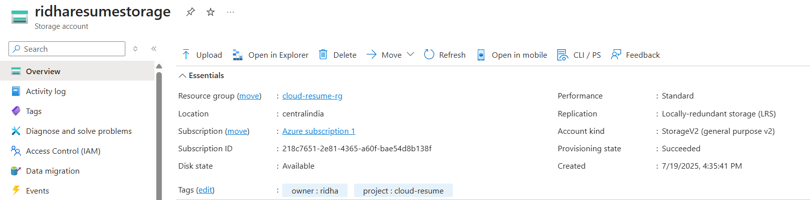
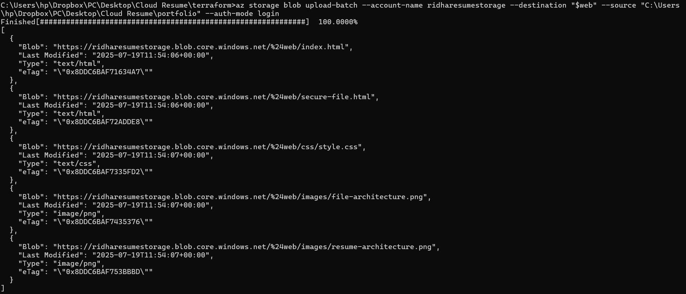
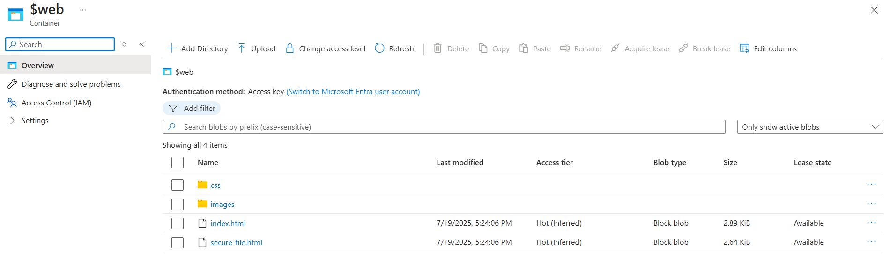
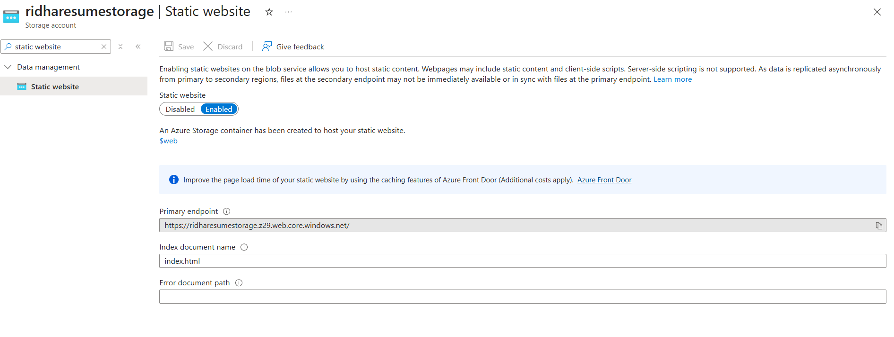
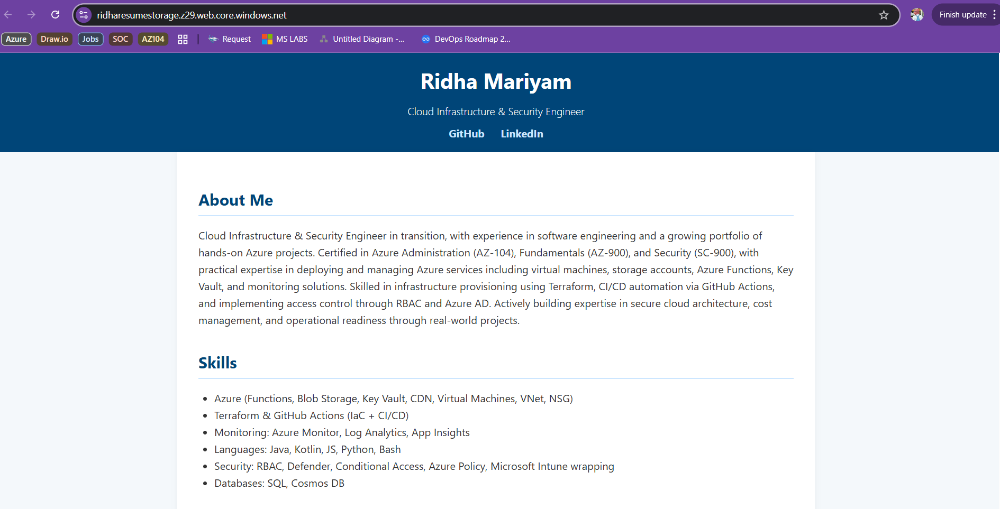

# Hosting Resume Website on Azure with Terraform

## 🎯 Objective
Deploy a static portfolio/resume website using Azure Storage Account (static website feature) and manage all infrastructure with Terraform.

---

## 🛠️ Tools Used
- **Terraform**
- **Azure CLI**
- **Azure Portal**
- **HTML/CSS**

---

## 🏗️ Resources Provisioned via Terraform

### Resource Group
```hcl
resource "azurerm_resource_group" "rg" {
  name     = "cloud-resume-rg"
  location = "Central India"
}
```

### Storage Account with Static Website Hosting
```hcl
resource "azurerm_storage_account" "resume_storage" {
  name                     = "ridharesumestorage"
  resource_group_name      = azurerm_resource_group.rg.name
  location                 = azurerm_resource_group.rg.location
  account_tier             = "Standard"
  account_replication_type = "LRS"

  static_website {
    index_document = "index.html"
  }

  tags = {
    project = "cloud-resume"
    owner   = "ridha"
  }
}
```



---

## 📂 Website Upload (via Azure CLI)
After deploying the storage account and enabling static website support, all resume files were uploaded:

```powershell
az storage blob upload-batch \
  --account-name ridharesumestorage \
  --destination "$web" \
  --source "C:\Users\hp\Dropbox\PC\Desktop\Cloud Resume\portfolio" \
  --auth-mode login
```


Container is created: 


> ⚠️ Ensure that the user has the **Storage Blob Data Contributor** role assigned to upload successfully.

---

## 🌐 Result
Website was publicly hosted at:
```
https://ridharesumestorage.z13.web.core.windows.net/
```



Accessible globally via Azure Static Website.



---

