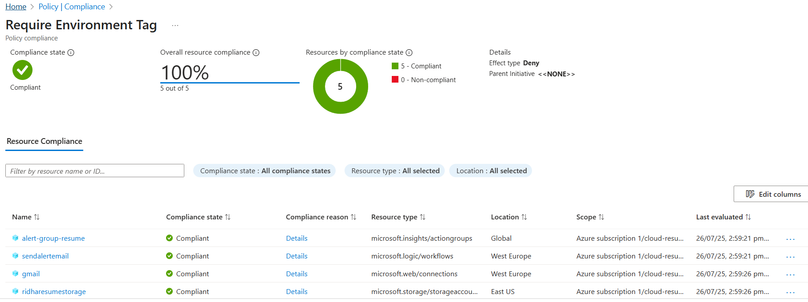

# 🛡️ Azure Policy Enforcement
Implemented Azure Policies to ensure tag usage among all the deployed resources. 

## 📌 Policy Used
- **Name:** Require a tag on resources
- **Scope:** Resource Group (`cloud-resume-rg`)
- **Tag Key:** `Environment`
- **Mode:** Indexed (automatic evaluation on supported resources)

### Initial Compliance states

## 🏁 Outcome
All resources passed compliance check and has `Environment` tag. Policy assignment now enforce these standards for future deployments.

