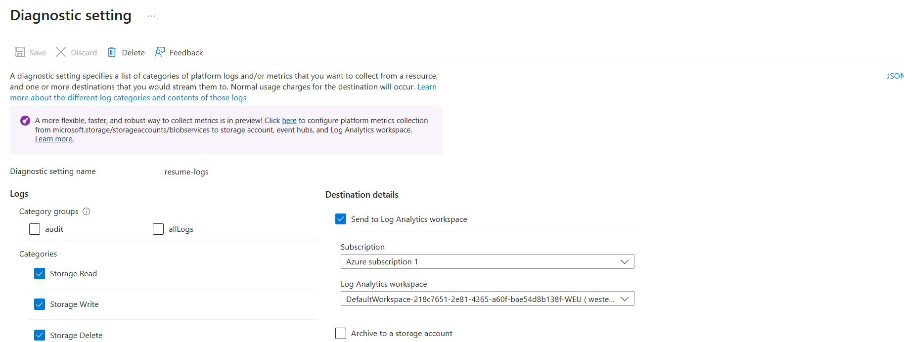
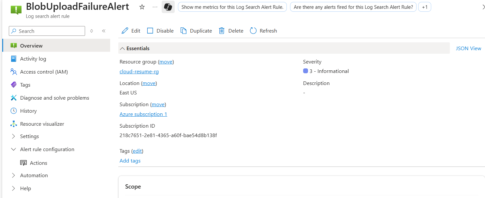
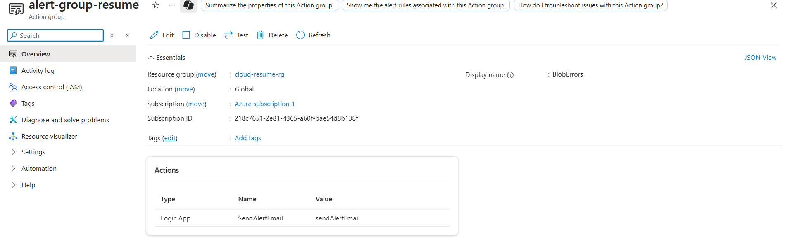
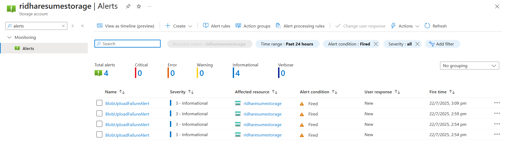
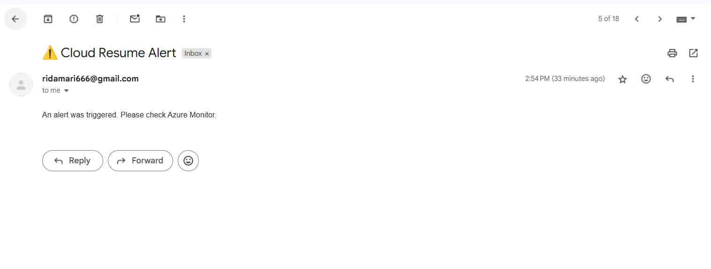
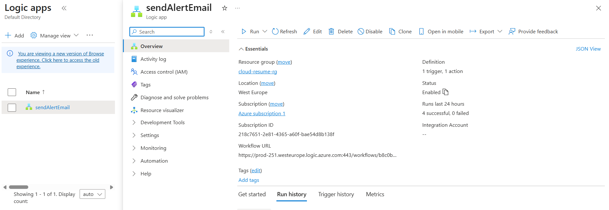
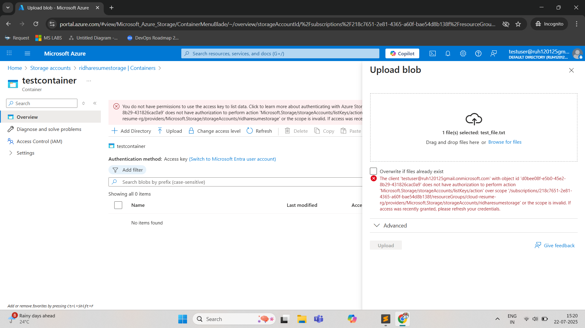
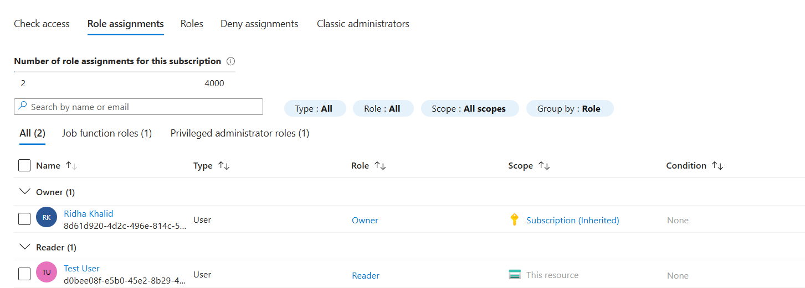
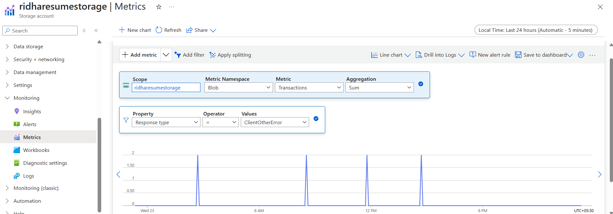

## 🔍 Monitoring and Alerts

Monitoring is implemented to track resource activity, error patterns, and security events for the Cloud Resume project.

### ✅ Diagnostic Settings for Storage Account

Azure Blob Storage was configured with **Diagnostic Settings** to forward logs to **Log Analytics Workspace**:

- **Logs Enabled**:
  - `StorageRead`, `StorageWrite`, `StorageDelete`
  - `StorageBlobLogs`
- **Destination**: Default Log Analytics workspace (auto-created by Azure)
  


---

### 📊 Log Analytics Query for Failed Uploads

To monitor failed upload/download operations (e.g., permission-denied uploads):

```kusto
StorageBlobLogs
| where toint(StatusCode) >= 400
| summarize FailedRequests=count() by bin(TimeGenerated, 5m)
```
---
### 🚨 Alert Rule Setup




---

### ⚙️ Action Group (Notification Mechanism)

An Action Group named alert-group-resume was created to respond to the alert trigger.


Action Type: Webhook → Logic App (named sendAlertEmail)
Function: Sends an email when the blob alert fires
Logic App: Triggered when alert rule is hit



Sends a formatted alert email


The Logic App was manually configured from the Azure portal using the blank logic app designer with HTTP trigger and email connector.


---
### 🧪 Testing Alerts

The alert was tested by simulating an unauthorized upload (RBAC-denied user). It triggered successfully and email was received from Logic App.



---
### 🔐 Access Control Testing (RBAC)

To ensure only specific roles can write to Blob Storage:
- A test user was created in Azure AD.
- Blob Contributor role was removed.
- Upload attempts by this user resulted in alerts and failed logs.
- Validated the alerting pipeline end-to-end.



---
### 📈 Metrics Monitoring

Azure Metrics Explorer was used to visualize:



This helped validate when the blob operations were active and correlate with error logs.

---


